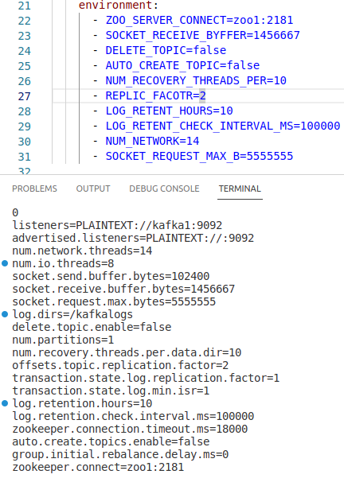

## Apache Kafka cluster

Для сборки необходимо запустить команду

``` shell
docker pull mshapovalov/kafka.alpine.cluster:latest
```
Не забудьте подставить необходимые переменныые из списка, Вы так же можете сделать fork данного репозиттория и дополнить параметрами, которые необходимы именно Вам. Так же Вам понадобиться кластер Zookeeper, его необходимо установить за ранее, и передать данныё параметр в environment
 К примеру различные варианты. 1 случай кластер из 3 нод и 3 zookeeper. Второй вариант one to one.
 
``` shell
-e ZOO_SERVERS="server.1=zoo1:2888:3888\nserver.2=0.0.0.0:2888:3888\nserver.3=zoo3:2888:3888"
-e ZOO_SERVERS="server.1=0.0.0.0:2888:3888\n"
```

Описание переменных которые можно изменить для Ваших задач

"Usually, you don't need to modify these settings, however, if you want to extract every last bit of performance from your machines, then changing some of them can help." 

- num.network.threads Кол-во сетевых потоков к кластеру Кафка, создание и получение запросов от клиентских приложений. Необходимо отрегулировать, чтобы отразить коэффициент репликаций и уровни активности продюсеров и консюмеров, взаимодейст. с кластером. По умолчанию 10, изменить можно  
``` shell
-e NUM_NETWORK=integer
```
- num.io.threads Потоки ввода-вывода получают запросы из очереди для их обработки. Добавление большего кол-ва потоков может повысит пропускную способность, но CPU и latency диска накладывают ограничения. Хорошей цифрой считаеться цифра по умолчанию. равной 8. Но Вы можете подправить.
```shell
-e NUM_IO_THREADS=integer
```
- socket.send.buffer.bytes устанавливает `SO_SNDBUFF` размер буфера, который используется для сокет-соединений. По умолчанию: 102400
``` shell
-e SOCKET_SEND_BUFFER=integer
```
- socket.receive.buffer.bytes устанавливает `SO_RCVBUFF` размер буфера, который используется для сокет-соединений. По умолчанию: 102400
```shell
-e SOCKET_RECEIVE_BYFFER=integer
```
- socket.request.max.bytes Устанавливает максимальное кол-во байтов, которое может получить Кафка. По умолчанию: 104857600
```shell
-e SOCKET_REQUEST_MAX_B=integer
```
- delete.topic.enable По умолчанию включенно, что позволяет уталять topic. Но в данном случае можно отключить
``` shell
-e DELETE_TOPIC=false
```
- auto.create.topics.enable включенно по умолчанию. Позволяет создавать темы пор мере необходимости. На боевых контурах отключают, чтоб-бы иметь больший контроль над кластером.
``` shell
-e AUTO_CREATE_TOPIC=false
```
- num.partitions Это устанавливает количество разделов по умолчанию для темы, которую вы создаете, без явного указания размера раздела: По умолчанию: 1
```shell
-e NUM_PARTITIONS=integer
```
- num.recovery.threads.per.data.dir Используйте данный параметр, чтобы указать кол-во потоков, которые необходимо использовать при загрузки журнала при старте и сбросе данных при остановки. По умолчанию: 1
```shell
-e NUM_RECOVERY_THREADS_PER=integer
```
- offsets.topic.replication.factor Коэффициент репликации для тем. Создание внутренней темы не будет выполнено до тех пор, пока размер кластера не будет соответствовать этому требовани. По умолчанию установленно: 1
``` shell
-e REPLIC_FACOTR=integer
```
- transaction.state.log.replication.factor Коэффициент репликации для топика транзакции. 
``` shell
-e TRANSACTION_STATE_LOG_REPLIC_FAC=integer
```
- transaction.state.log.min.isr 
``` shell
-e TRANSACTION_STATE_LOG_MIN_ISR=integer
```
- log.retention.hours Кол-во часов хранения файла журнала перед его удалением в часах. По умолчанию установленно: 168
``` shell
-e LOG_RETENT_HOURS=integer
```
- log.retention.check.interval.ms С какой частой происходит проверка, не пара ли чистить журнал и удалять данные. По умолчанию: 300000
``` shell
-e LOG_RETENT_CHECK_INTERVAL_MS=integer (300000 ms = 5 минут)
```
- zookeeper.connect Необходимо указать ZOOKEEPER SERVERA для соединения кафки. 
``` shell
- e ZOO_SERVER_CONNECT=zoo1:2181,z002:2181,zoo3:2181
```
Для примера можно опробовать все переменные с помощью docker-compose_test.yaml

